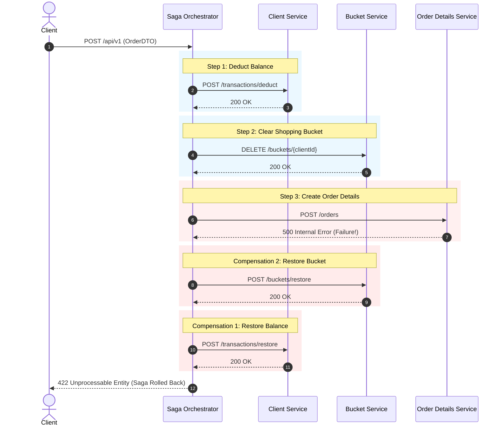

# Saga Orchestrator Service

The **Saga Orchestrator** is a lightweight, stateless microservice responsible for coordinating distributed transactions across domain services during the order checkout process. It implements the **Orchestration-based SAGA Pattern** with forward step execution and automatic compensating rollbacks.

---

## 💡 Architectural Design: "Smart Endpoints, Dumb Pipes"

**Yes, the Saga Orchestrator is intentionally "dumber" than the object/domain services—and by design, this is a best-practice architectural pattern!**

```
                     ┌────────────────────────┐
                     │   Saga Orchestrator    │
                     │  (Stateless Workflow)  │
                     └───────────┬────────────┘
                                 │
         ┌───────────────────────┼───────────────────────┐
         ▼                       ▼                       ▼
┌──────────────────┐   ┌──────────────────┐   ┌──────────────────┐
│  Client Service  │   │  Bucket Service  │   │  Order Service   │
│ (Account/Balance)│   │ (Cart Lifecycle) │   │ (Order Storage)  │
│  [Smart Domain]  │   │  [Smart Domain]  │   │  [Smart Domain]  │
└──────────────────┘   └──────────────────┘   └──────────────────┘
```

### Why being domain-agnostic ("dumb") is an architectural strength:
1. **Separation of Concerns:** The orchestrator contains **zero business/domain logic** (no pricing formulas, discount calculations, inventory levels, or user schemas). It acts solely as a state coordinator and execution pipeline.
2. **Stateless & High Availability:** It owns no business database. If an instance restarts, it carries no persistent entity baggage.
3. **Smart Endpoints:** Domain services (`Client`, `Bucket`, `OrderDetails`, `Product`) manage their own business invariants, databases (PostgreSQL), caches (Redis), and event streams (Kafka).
4. **Resilience & Fault Isolation:** The orchestrator focuses entirely on network resilience, retry policies, and reliable compensating transactions (backward recovery).
5. **Extensibility:** Modifying business rules in domain services does not require modifying the orchestrator. New saga steps can be composed declaratively via `SagaDefinition`.

---

## 🔄 Saga Execution Flow

When a client initiates an order checkout (`POST /api/v1`), the orchestrator executes the saga steps sequentially. If any step fails, all previously completed steps are rolled back in **reverse order**.



---

## 📋 Saga Steps Specification

| Step | Forward Action (`process`) | Compensating Action (`revert`) | Target Service |
| :--- | :--- | :--- | :--- |
| **1. ClientBalanceStep** | `POST /transactions/deduct` | `POST /transactions/restore` | `client` |
| **2. BucketStep** | `DELETE /buckets/{clientId}` | `POST /buckets/restore` | `bucket` |
| **3. OrderStep** | `POST /orders` | `DELETE /orders/{orderId}` | `order` |

---

## 🛡️ Resilience & Idempotency

- **Redis-Backed Idempotency (`RedisSagaIdempotencyService`):**
  - Uses Redis (`saga:order:{orderId}`) with `SETNX` distributed locks to prevent duplicate / concurrent saga executions.
  - Caches completed (`COMPLETED`) and rolled back (`ROLLED_BACK`) execution states (24h TTL) to immediately replay responses on client retries without re-invoking downstream services.
  - Rejects concurrent duplicate requests with `409 Conflict`.
- **Resilience4j Integration:** Configurable retries decorated onto step operations.
- **Smart Retry Predicate (`RetryResultPredicate`):**
  - **4xx Client Errors:** Considered permanent failures (e.g., insufficient balance, invalid payload) ➔ **No retry**, triggers immediate rollback.
  - **5xx / Network Errors:** Considered transient failures ➔ **Retried** up to `max-attempts` before triggering rollback.
- **Type-Safe Sealed Results:** Steps return `SagaStepResult.Success` or `SagaStepResult.Failure(message, cause, retryable)` to cleanly communicate status without exception leakage.

---

## 📖 API Documentation

### `POST /api/v1`
Starts the distributed order creation saga.

#### Request Body (`OrderDTO`):
```json
{
  "orderId": "3fa85f64-5717-4562-b3fc-2c963f66afa6",
  "clientId": 123,
  "items": [
    {
      "id": 1,
      "name": "Mechanical Keyboard",
      "quantity": 1,
      "price": 99.99
    }
  ],
  "totalSum": 99.99
}
```

#### Response (`SagaResponseDTO`):
- **Success (`200 OK`):**
  ```json
  {
    "orderId": "3fa85f64-5717-4562-b3fc-2c963f66afa6",
    "success": true,
    "message": "Order saga completed successfully"
  }
  ```
- **Failure (`422 Unprocessable Entity`):**
  ```json
  {
    "orderId": "3fa85f64-5717-4562-b3fc-2c963f66afa6",
    "success": false,
    "message": "Order saga failed and compensations were executed"
  }
  ```
- **Bad Request (`400 Bad Request`):** Validation failure on incoming payload.

---

## ⚙️ Configuration Properties

Configured via `application.yaml` or environment variables:

```yaml
server:
  port: ${SERVER_PORT:7018}

services:
  client:
    deduct-url: ${CLIENT_DEDUCT_URL:http://client/api/v1/clients/transactions/deduct}
    restore-url: ${CLIENT_RESTORE_URL:http://client/api/v1/clients/transactions/restore}
  bucket:
    clear-url: ${BUCKET_CLEAR_URL:http://bucket/api/v1/buckets/{clientId}}
    restore-url: ${BUCKET_RESTORE_URL:http://bucket/api/v1/buckets/restore}
  order:
    create-url: ${ORDER_CREATE_URL:http://order/api/v1/orders}
    remove-url: ${ORDER_REMOVE_URL:http://order/api/v1/orders/{orderId}}

resilience:
  retry:
    max-attempts: ${RETRY_MAX_ATTEMPTS:3}
    wait-duration: ${RETRY_WAIT_DURATION:1s}
    suffix: ${RETRY_SUFFIX:RevertRetry}
    process-enabled: ${RETRY_PROCESS_ENABLED:false}
    revert-enabled: ${RETRY_REVERT_ENABLED:true}
```

---

## 🛠️ Technology Stack

- **Java 17**
- **Spring Boot 3.3.3**
- **Spring Cloud 2023.0.3** (Eureka Client & LoadBalancer)
- **Spring Web / RestClient** (HTTP client with tracing)
- **Resilience4j** (Retry policies & fault tolerance)
- **Micrometer Tracing & Zipkin** (Distributed request correlation)
- **WireMock & JUnit 5** (Integration testing)

---

## 🚦 Running & Testing

### Build & Run Unit/Integration Tests
```bash
./mvnw clean test
```

### Run Service
```bash
./mvnw spring-boot:run
```
Service runs on port `7018` by default.
